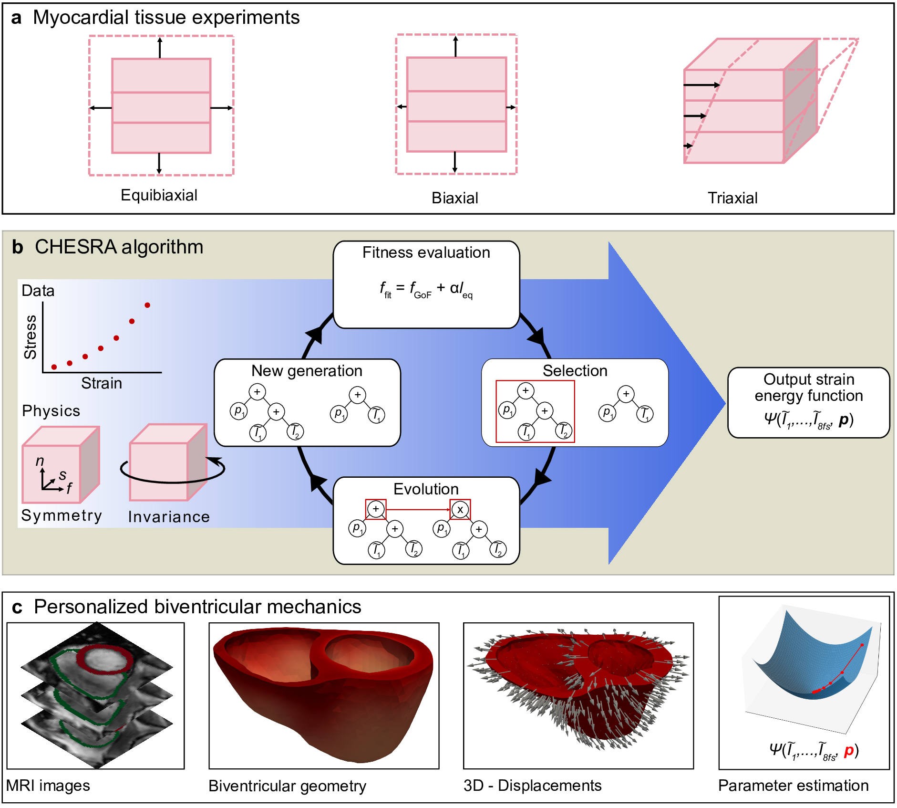

# Cardiac Hyperelastic Evolutionary Symbolic Regression Algorithm (CHESRA)

CHESRA was developed to automatically derive cardiac strain energy functions (SEFs) from experimental data. 
It is an evolutionary framework that manipulates symbolic representations of cardiac SEFs to fit experimental 
observations while minimizing SEF complexity. CHESRA takes one or more experimental 
datasets of myocardial stress-strain relations as input and evolves a population 
of SEFs according to the fitness function $f_\text{fit}$ (Fig. 1).


Fig. 1: Overview of CHESRA

## Dependencies

>Python = 3.10.6
> 
>deap = 1.3.3
> 
>func_timeout = 4.3.5
>
>lmfit = 1.0.3
> 
>matplotlib = 3.5.3
>
>numpy = 1.23.4
>
>pandas = 1.4.4
> 
>scipy = 1.9.3
> 
>seaborn = 0.13.2
> 
>sympy = 1.10.1
>
>dolfin = 2019.2.0.dev0
>
>yaml = 6.0.2


## Experiment Reproduction

We provide three reproduction scripts: 1) for creating SEFs with CHESRA and visualizing their fits to experimental data
2) for benchmarking the parameter variability when fitting CHESRA functions to tissue data and comparison to the full set of state-of-the art SEFs 3) for benchmarking 
of parameter variability in 3D biventricular simulations with CHESRA functions and two state-of-the art SEFs. 

0. Download repository and all required packages

1. Create SEFs with CHESRA

>`cd Experiments/CHESRAFunctions`
> 
>`python3 run_experiment.py`
> 
>`python3 create_figure.py`
> 
**Note:** use the default options to run experiments similar to those in the paper. Due to random initial conditions your results may vary.

>`python3 run_experiment.py --help`


2. Parameter variability benchmark using tissue data
>`cd Experiments/Tissue_Benchmark`
> 
>`python3 run_experiment.py`
> 
>`python3 create_figure.py`

3. Parameter variability benchmark using a 3D biventricular simulations

>`cd Experiments/3DSimulation_Benchmark`
> 
>`python3 run_experiment.py -energy_function chesra1 -scenario in_vivo_CMR`
> 
>`python3 run_experiment.py -energy_function chesra2 -scenario in_vivo CMR`
> 
>`python3 run_experiment.py -energy_function holzapfel-ogden -scenario in_vivo CMR` 
> 
>`python3 run_experiment.py -energy_function martonova3 -scenario in_vivo CMR`
> 
>`python3 run_experiment.py -energy_function chesra1 -scenario ex_vivo_Klotz`
> 
>`python3 run_experiment.py -energy_function chesra2 -scenario ex_vivo Klotz`
> 
>`python3 run_experiment.py -energy_function holzapfel-ogden -scenario ex_vivo Klotz` 
> 
>`python3 run_experiment.py -energy_function martonova3 -scenario ex_vivo Klotz`
>
>`python3 create_figure.py`

## 3D Biventricular Simulation Data
The biventricular simulation benchark requires LV pressure-volume traces, pressure-free biventricular geometries and corresponding synthetic motion fields. These data are included in the file `3Dsimulation_data.zip` and should unzipped before running the biventricular simulations benchmark. For the sake of completeness the original (pressurized) mesh at end-diastole is included as the file `pressurized_bivmesh_60fibres.h5`. To access the 3D biventricular simulation data you can use [Git LFS](https://git-lfs.com/).

>`git lfs fetch`
> 
>`git lfs checkout`


**Important Notice: Git LFS Required**
>
> This repository uses [Git Large File Storage (Git LFS)](https://git-lfs.github.com/) to manage large files (e.g., `3Dsimulation_data.zip`). You will need to install and configure git LFS *before* cloning this repository to access the 3D biventricular simulation data.


## Docker

### Pull the publicly available Docker container from DockerHub
```bash
docker pull gabrielbalaban/chesra:1.0.0
docker run --rm -it gabrielbalaban/chesra:1.0.0
```

### Build your own Docker container
```bash
git clone https://github.com/GabrielBalabanResearch/CHESRA.git
cd CHESRA
git lfs pull                    # fetch 3D simulation data
docker build -t chesra .
docker run --rm -it \
  -v "$(pwd)/Experiments/3DSimulation_Benchmark:/workspace/Experiments/3DSimulation_Benchmark" \
  chesra
```